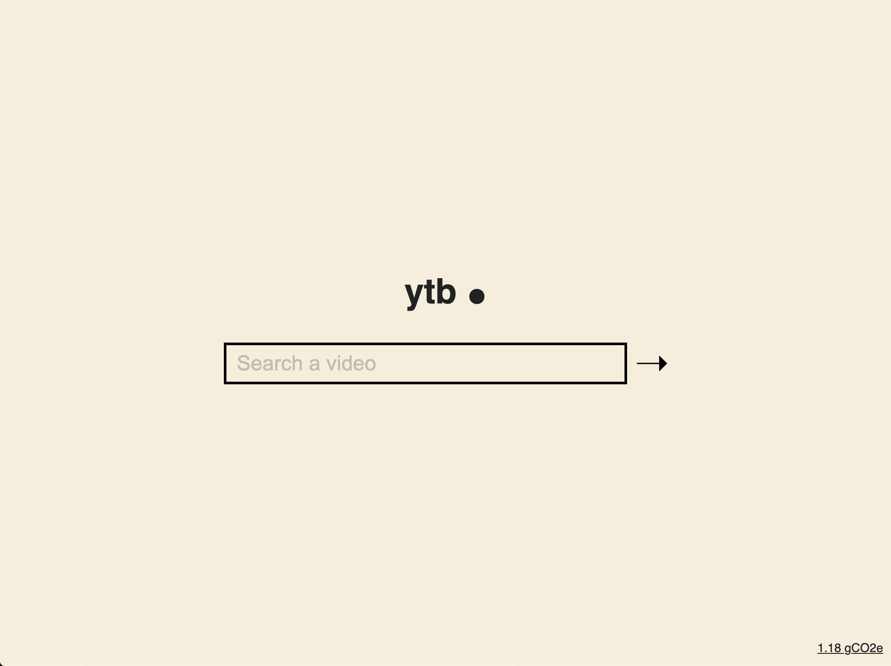

# ytb

A low-tech youtube.

This is mainly an experiment to make the less impactfull video plateform while atempting to do less harm to environnement and to people minds.

## Demo

[](https://ytb.bastiencornier.com)

## Tech

- Starter is based on : [sstnbl](https://github.com/Bastou/sstnbl)
- Vanilla js and css kepts to minimal
- For the videos I use the api from [invidious instances](https://github.com/iv-org/invidious), I don't host them.

## Features

The app respect the one page one feature principle.

- Search a video
- List videos from search query
- Play video
- And nothing else

## Getting Started

### 1. Clone this Repository

```
git clone https://github.com/11ty/eleventy-base-blog.git my-website
```

### 2. Navigate to the directory

```
cd my-website
```

Specifically have a look at `.eleventy.js` to see if you want to configure any Eleventy options differently.

### 3. Install dependencies

```
npm install
```

Install eleventy

```
npm i -g eleventy
```

### 4. Edit \_data/metadata.json

### 5. Run Project

build and host locally for local development with watcher

```
npm run start
```

build project

```
npm run build
```

to debug:

```
npm run e11:debug
```
